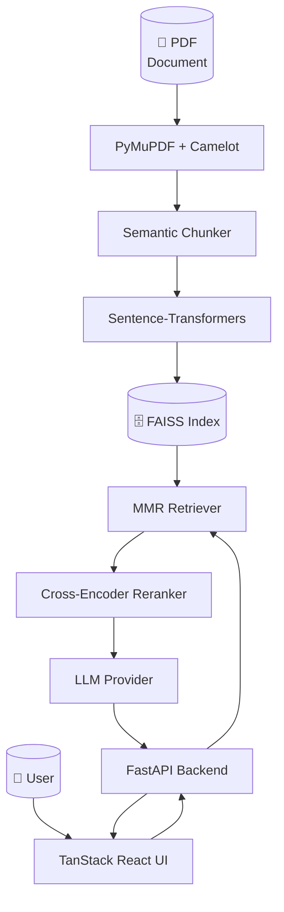

<div align="center">
  <br/>
  <picture>
    <source media="(prefers-color-scheme: dark)" srcset="https://capsule-render.vercel.app/api?type=waving&height=200&color=gradient&customColorList=0,2,4,6&text=RAG%20Depoly&fontSize=60&fontAlignY=35&desc=Full-Stack%20Retrieval-Augmented%20Generation%20Pipeline&descAlignY=55&animation=fadeIn">
    
  </picture>
</div>

<p align="center">
  <strong>Ask questions against your documents. Get grounded, sourced answers.</strong>
</p>

<p align="center">
  <a href="#features">Features</a> •
  <a href="#architecture">Architecture</a> •
  <a href="#quick-start">Quick Start</a> •
  <a href="#api-reference">API</a> •
  <a href="#configuration">Configuration</a> •
  <a href="#tech-stack">Tech Stack</a>
</p>

<p align="center">
  
  
  
  
</p>

<div align="center">
  <a href="https://www.loom.com/share/9681edb4611d4484bd8a5a8d4c16e40d" target="_blank">
    
  </a>
</div>

---

## Features

<div align="center">
  <table>
    <tr>
      <td align="center"><b>🧠 RAG Pipeline</b></td>
      <td align="center"><b>🔍 Smart Retrieval</b></td>
      <td align="center"><b>🤖 Multi-LLM</b></td>
    </tr>
    <tr>
      <td>Ingest PDFs (text + tables), chunk, embed, and index into FAISS for instant semantic search</td>
      <td>MMR retrieval with cross-encoder reranking for precision-grounded answers</td>
      <td>Drop in any API key — Gemini, OpenAI, or Anthropic — or use the server default</td>
    </tr>
    <tr>
      <td align="center"><b>⚡ Real-Time Chat</b></td>
      <td align="center"><b>📎 Source Citations</b></td>
      <td align="center"><b>🌙 Beautiful UI</b></td>
    </tr>
    <tr>
      <td>Modern chat interface with typing indicators, markdown rendering, and code highlighting</td>
      <td>Every answer links back to its source document with page numbers and content previews</td>
      <td>Dark-themed aurora gradient UI with smooth animations and responsive design</td>
    </tr>
    <tr>
      <td align="center"><b>📤 Export</b></td>
      <td align="center"><b>💾 Query Caching</b></td>
      <td align="center"><b>⚙️ CLI + API</b></td>
    </tr>
    <tr>
      <td>Export full chat transcripts as Markdown with one click</td>
      <td>In-memory caching for repeated queries — instant responses on re-asks</td>
      <td>Full CLI (ingest, query, REPL, server) plus REST API</td>
    </tr>
  </table>
</div>

---

## Architecture



### Data Flow

```
PDF → Loader (text + tables) → Chunker (1500/250) → Embeddings → FAISS Index
                                                                      ↓
User Question → MMR Retrieve (k=10) → Rerank (top-5) → LLM → Grounded Answer + Sources
```

---

## Quick Start

### Prerequisites

- Python 3.11+
- Node.js 20+
- An API key from [Google Gemini](https://aistudio.google.com/), [OpenAI](https://platform.openai.com/), or [Anthropic](https://console.anthropic.com/)

### Backend

```bash
cd backend/pipeline

python3 -m venv venv
source venv/bin/activate
pip install -r requirements.txt

cp .env.example .env
# Edit .env with your API key

# Ingest the PDF and start the server
python3 -m src.cli --ingest
python3 -m src.cli --server
```

The backend runs on **`http://localhost:8000`**.

### Frontend

```bash
cd frontend

npm install
npm run dev
```

The frontend runs on **`http://localhost:5173`**.

Set `VITE_CHAT_API_URL` in `.env` to point at your backend (e.g., `http://localhost:8000/chat` or your deployed URL).

---

## CLI Usage

```bash
# Ingest PDF → FAISS index
python3 -m src.cli --ingest

# Start the API server
python3 -m src.cli --server

# Ask a question
python3 -m src.cli --query "What was Microsoft's total revenue in FY2025?"

# Interactive REPL
python3 -m src.cli --repl
```

---

## API Reference

### `GET /health`
Returns service health, indexed chunk count, and cache size.

### `POST /ingest`
Triggers the ingestion pipeline (PDF → chunks → FAISS index).

### `POST /query` or `POST /chat`
Ask a question against the ingested document.

```json
{
  "question": "What was Microsoft's total revenue in FY2025?",
  "api_key": "AIza..."  // optional: override the server default
}
```

Response:

```json
{
  "answer": "Microsoft's total revenue in FY2025 was **$281.724 billion**.",
  "sources": [
    { "page": 59, "type": "table", "content": "..." },
    { "page": 57, "type": "text", "content": "..." }
  ],
  "provider": "google"
}
```

---

## Configuration

All runtime settings live in `backend/pipeline/config.yaml`:

| Section | Key | Default | Description |
|---------|-----|---------|-------------|
| `embeddings` | `model` | `all-MiniLM-L6-v2` | Sentence-transformer model |
| `chunking` | `chunk_size` | `1500` | Characters per chunk |
| `chunking` | `chunk_overlap` | `250` | Overlap between chunks |
| `retriever` | `type / k / fetch_k` | `mmr / 10 / 20` | Retrieval strategy |
| `reranker` | `model / top_k` | `ms-marco-MiniLM-L6-v2 / 5` | Cross-encoder model |
| `llm` | `provider / model` | `google / gemini-2.0-flash` | LLM provider + model |
| `llm` | `temperature` | `0.2` | LLM temperature |
| `cache` | `backend / max_size` | `memory / 100` | Query cache settings |
| `server` | `host / port` | `0.0.0.0 / 8000` | Server bind address |

---

## Project Structure

```
Rag-Depoly/
├── backend/
│   └── pipeline/
│       ├── config.yaml              # Runtime configuration
│       ├── requirements.txt         # Python dependencies
│       ├── pyproject.toml           # Package metadata
│       └── src/
│           ├── cli.py               # CLI entry point
│           ├── config.py            # Pydantic config loader
│           ├── cache.py             # In-memory query cache
│           ├── pipeline.py          # Orchestrator
│           ├── api/
│           │   ├── models.py        # Request/response schemas
│           │   ├── routes.py        # FastAPI routes
│           │   └── server.py        # FastAPI app with lifecycle
│           ├── ingestion/
│           │   ├── loader.py        # PDF loader (text + tables)
│           │   ├── chunker.py       # Text splitter
│           │   └── vectorstore.py   # FAISS index builder
│           ├── retrieval/
│           │   ├── embedder.py      # Embedding model
│           │   ├── retriever.py     # MMR retriever
│           │   └── reranker.py      # CrossEncoder reranker
│           └── generation/
│               ├── prompt.py        # Prompt templates
│               └── llm.py           # LLM client
│
└── frontend/
    └── src/
        ├── routes/
        │   └── index.tsx             # Main chat page
        ├── lib/
        │   └── config.server.ts      # Server config
        └── styles.css                # Tailwind v4 + theme
```

---

## Tech Stack

| Layer | Technology |
|-------|-----------|
| **Frontend** | TanStack Start, React 19, Tailwind CSS v4, Vite |
| **Backend** | Python 3.11+, FastAPI, Uvicorn |
| **Vector Store** | FAISS (CPU) |
| **Embeddings** | Sentence-Transformers (`all-MiniLM-L6-v2`) |
| **Reranking** | Cross-Encoder (`ms-marco-MiniLM-L6-v2`) |
| **LLM Providers** | Google Gemini, OpenAI, Anthropic Claude |
| **PDF Parsing** | PyMuPDF (text), Camelot (tables) |
| **Orchestration** | LangChain |
| **Caching** | In-memory LRU cache |

---

## Deployment

This project is configured for deployment on [Railway](https://railway.app/). The frontend uses `VITE_CHAT_API_URL` to connect to the deployed backend.

```bash
# Backend
railway up --service rag-backend

# Frontend
railway up --service rag-frontend
```

---

## Contributing

Contributions are welcome! Feel free to open issues or submit pull requests.

1. Fork the repository
2. Create a feature branch (`git checkout -b feature/your-feature`)
3. Commit your changes (`git commit -m 'Add some feature'`)
4. Push to the branch (`git push origin feature/your-feature`)
5. Open a Pull Request

---

<div align="center">
  <sub>Built by <strong>Hamza</strong> with ❤️ and ☕</sub>
  <br/>
  <sub>MIT License — use freely, build boldly.</sub>
</div>
